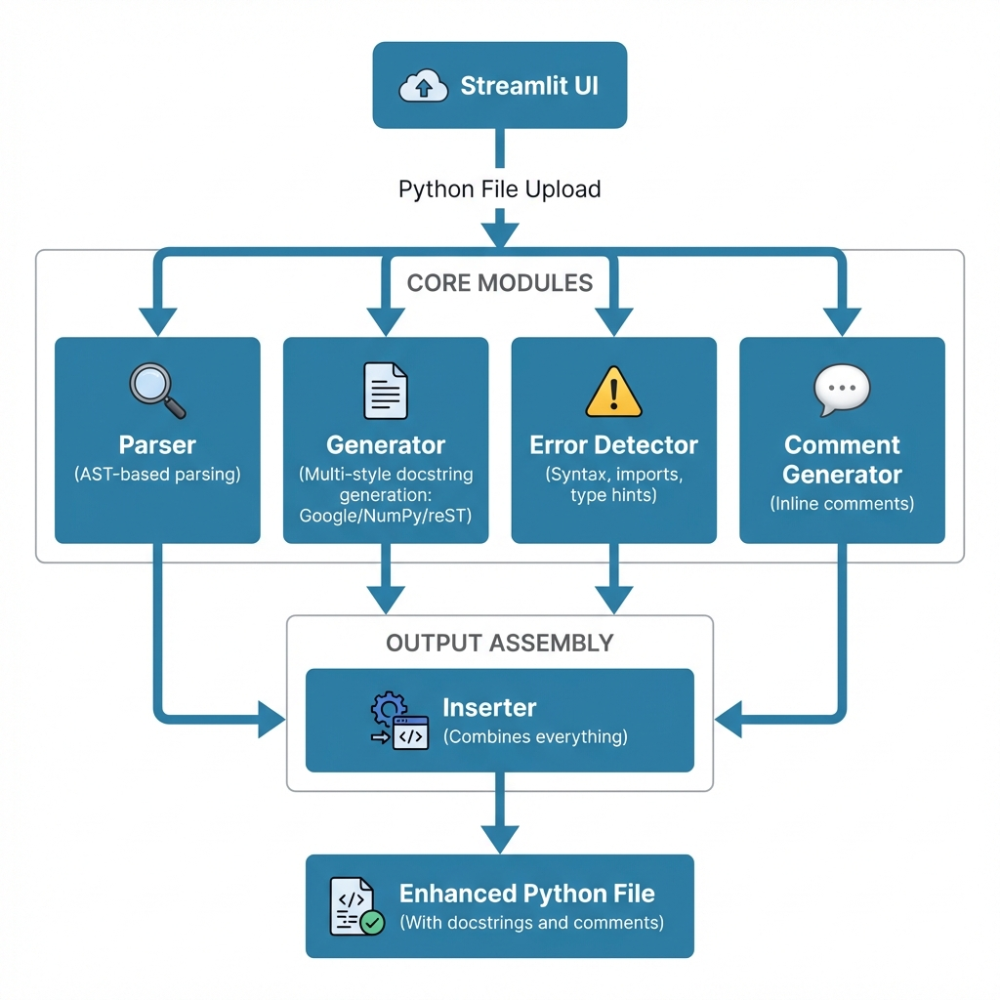
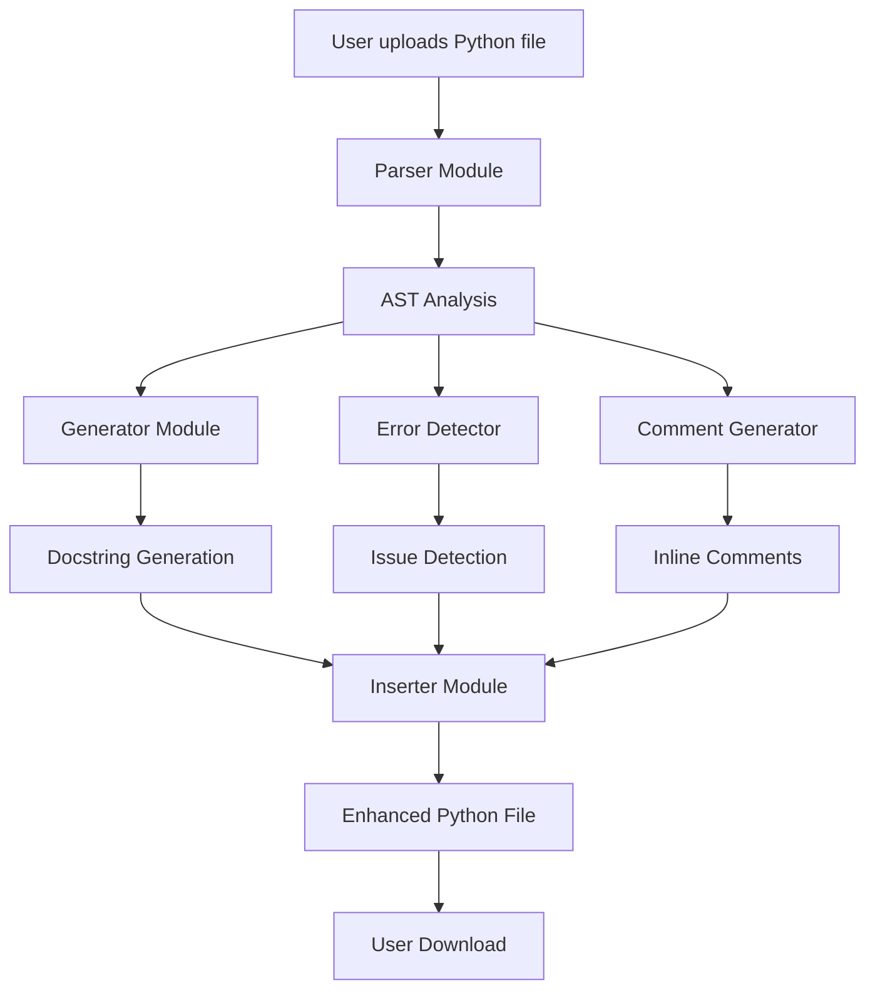

# Python Docstring Generator

> **Automated docstring generation with multiple style support, error detection, and inline comments**

[](https://www.python.org/downloads/)
[](https://streamlit.io/)
[](LICENSE)

---

## 📖 Overview

**Python Docstring Generator** is a powerful, template-based tool that automatically generates professional docstrings for your Python code. It supports multiple docstring styles (Google, NumPy, reST), detects code issues, and adds helpful inline comments—all through a clean, intuitive web interface.

### ✨ Key Features

- 🎨 **Multiple Docstring Styles** - Google, NumPy, and reStructuredText (reST)
- 🔍 **Error Detection** - Identifies syntax errors, unused imports, and missing type hints
- 💬 **Inline Comments** - Automatically adds comments for complex code constructs
- ✅ **Smart Detection** - Preserves existing docstrings
- 🎯 **Selective Generation** - Review and accept only the docstrings you want
- ⚡ **Instant Generation** - Template-based, no API calls required
- 🎨 **Clean UI** - Simple 3-step workflow

---

## 🏗️ Architecture



### System Components



### Module Breakdown

| Module                                         | Purpose                                    | Key Functions                                                 |
| ---------------------------------------------- | ------------------------------------------ | ------------------------------------------------------------- |
| **Parser** (`parser.py`)                       | Extracts function/class metadata using AST | `parse_python_file()`                                         |
| **Generator** (`generator.py`)                 | Creates docstrings in multiple styles      | `generate_function_docstring()`, `generate_class_docstring()` |
| **Error Detector** (`error_detector.py`)       | Identifies code issues                     | `detect_issues()`                                             |
| **Comment Generator** (`comment_generator.py`) | Adds inline comments                       | `generate_inline_comments()`                                  |
| **Inserter** (`inserter.py`)                   | Combines docstrings into source code       | `insert_docstrings()`                                         |
| **Models** (`models.py`)                       | Data structures for metadata               | `FunctionInfo`, `ClassInfo`, `Parameter`                      |
| **App** (`app.py`)                             | Streamlit UI and workflow                  | Main application                                              |

---

## 🚀 Quick Start

### Installation

```bash
# Clone the repository
git clone https://github.com/Megesh07/Python-Doctring-Generator.git
cd Python-Docstring-Generator

# Install dependencies
pip install -r requirements.txt
```

### Run the Application

```bash
streamlit run app.py
```

The app will open in your browser at `http://localhost:8501`

---

## 📚 How It Works

### Step 1: Upload Python File

Upload any Python file (`.py`) through the web interface.

### Step 2: Review Generated Docstrings

- View all generated docstrings
- See detected code issues
- Accept or reject individual docstrings

### Step 3: Download Enhanced Code

Download your Python file with the accepted docstrings and inline comments.

---

## 🎨 Docstring Styles

### Google Style (Default)

```python
def calculate_sum(a: int, b: int) -> int:
    """
    Calculate Sum function.

    Args:
        a (int): The a parameter.
        b (int): The b parameter.

    Returns:
        int: Return value.
    """
    return a + b
```

### NumPy Style

```python
def calculate_sum(a: int, b: int) -> int:
    """
    Calculate Sum function.

    Parameters
    ----------
    a : int
        The a parameter.
    b : int
        The b parameter.

    Returns
    -------
    int
        Return value.
    """
    return a + b
```

### reST Style

```python
def calculate_sum(a: int, b: int) -> int:
    """
    Calculate Sum function.

    :param a: The a parameter.
    :type a: int
    :param b: The b parameter.
    :type b: int
    :returns: Return value.
    :rtype: int
    """
    return a + b
```

---

## 🔍 Features in Detail

### 1. Docstring Generation

- **Purpose**: Generates clear function/class descriptions
- **Parameters**: Documents all parameters with types and defaults
- **Returns**: Includes return type information
- **Filters**: Automatically excludes `self` and `cls` parameters

### 2. Error Detection

Detects and reports:

- ✅ Syntax errors
- ✅ Unused imports
- ✅ Missing type hints (parameters)
- ✅ Missing return type hints

### 3. Inline Comments

Automatically adds comments for:

- List comprehensions
- Dictionary comprehensions
- Lambda functions
- Try-except blocks
- Context managers

### 4. Existing Docstring Detection

- Preserves existing docstrings
- Shows "Already documented" status
- Skips generation for documented items

---

## 📁 Project Structure

```
Python-Docstring-Generator/
├── app.py                     # Main Streamlit application
├── models.py                  # Data classes (FunctionInfo, ClassInfo, etc.)
├── parser.py                  # AST-based Python code parser
├── generator.py               # Multi-style docstring generator
├── inserter.py                # Docstring insertion logic
├── error_detector.py          # Code issue detection
├── comment_generator.py       # Inline comment generation
├── sample.py                  # Example Python file for testing
├── requirements.txt           # Python dependencies
├── README.md                  # This file
└── .gitignore                 # Git ignore rules
```

---

## 🛠️ Technical Details

### Technologies Used

- **Python 3.8+** - Core language
- **Streamlit** - Web UI framework
- **AST (Abstract Syntax Tree)** - Code parsing
- **Dataclasses** - Data structures

### Key Design Decisions

1. **Template-Based Generation**
   - No AI/API dependencies
   - Instant generation
   - Completely offline
   - Free to use

2. **AST Parsing**
   - Accurate code analysis
   - Extracts metadata reliably
   - Handles complex Python syntax

3. **Multi-Style Support**
   - Supports 3 major docstring styles
   - Easy to add new styles
   - Consistent formatting

---

## 📊 Example Usage

### Input Code

```python
def calculate_area(length, width):
    return length * width

class DataProcessor:
    def process(self):
        return [x * 2 for x in self.data]
```

### Generated Output (Google Style)

```python
def calculate_area(length, width):
    """
    Calculate Area function.

    Args:
        length: The length parameter.
        width: The width parameter.
    """
    return length * width

class DataProcessor:
    """
    Data Processor class.

    Provides methods: process.
    """
    def process(self):
        """
        Process function.
        """
        return [x * 2 for x in self.data]  # List comprehension
```

---

## 🎯 Use Cases

- **Code Documentation** - Quickly document existing codebases
- **Code Review** - Ensure all functions are documented
- **Learning** - Understand proper docstring formatting
- **Standardization** - Enforce consistent documentation style
- **Open Source** - Prepare code for public release

---

## 🤝 Contributing

Contributions are welcome! Please feel free to submit a Pull Request.

---

## 📝 License

This project is licensed under the MIT License - see the LICENSE file for details.

---

## 🙏 Acknowledgments

- Built with [Streamlit](https://streamlit.io/)
- Inspired by Python documentation best practices
- Supports [PEP 257](https://www.python.org/dev/peps/pep-0257/) docstring conventions

---

## 📧 Contact

For questions or feedback, please open an issue on GitHub.

---

**Made with ❤️ for the Python community**
